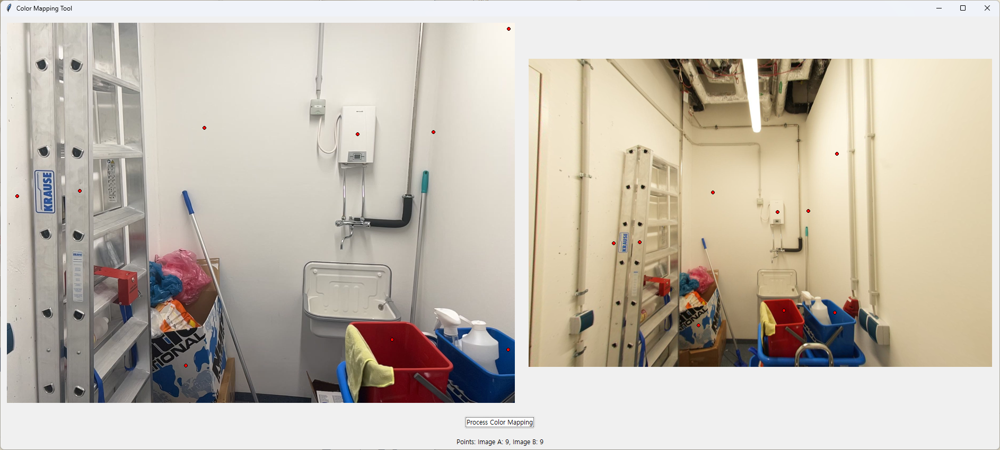

# Point Matching Color Transform Tool

This tool provides a GUI-based solution for color mapping and color transformation between two images using point matching and polynomial regression.

## Features

- Interactive GUI for selecting corresponding points between two images
- Polynomial regression-based color mapping
- Batch processing of multiple images
- Automatic coefficient saving and loading
- Preview of transformed images

## Requirements

- Python 3.7+
- Required packages (see requirements.txt):
  - numpy
  - opencv-python
  - scikit-learn
  - Pillow
  - tkinter

## Installation

1. Clone this repository
2. Install the required packages:
```bash
pip install -r requirements.txt
```

## Usage

### 1. Color Mapping Setup

1. Place your source image as `A.jpg` and target image as `B.jpg` in the project directory
2. Run the color mapping tool:
```bash
python color_mapping.py
```
3. In the GUI:
   - Click on corresponding points in both images
   - Select at least 3 points for meaningful color mapping
   - Click "Process Color Mapping" to generate the transformation coefficients

### 2. Batch Image Transformation

To transform multiple images using the generated coefficients:

```bash
python transform_images.py input_directory [output_directory] [--coefficients path/to/coefficients.json] [--processes N]
```

Arguments:
- `input_directory`: Directory containing images to transform
- `output_directory`: (Optional) Directory to save transformed images. Defaults to input_directory + "_transformed"
- `--coefficients`: (Optional) Path to coefficients JSON file. Defaults to "mapping_coefficients.json"
- `--processes` or `-p`: (Optional) Number of CPU processes to use for parallel processing. Defaults to the number of CPU cores in your system

Examples:
```bash
# Use default number of processes (equal to CPU cores)
python transform_images.py input_directory output_directory

# Use 4 processes
python transform_images.py input_directory output_directory --processes 4

# Use short option for processes
python transform_images.py input_directory output_directory -p 4
```

## Performance

- The tool uses multiprocessing to speed up batch image processing
- By default, it uses all available CPU cores for parallel processing
- You can control the number of processes to balance between processing speed and system resources
- For optimal performance, set the number of processes equal to or slightly less than your CPU core count

## Example

1. Select corresponding points in the GUI:
   

2. After processing, the transformed image will be saved as `transformed_A.png`

3. The color mapping coefficients will be saved in `mapping_coefficients.json`

## Notes

- The tool uses polynomial regression (degree 2) for color mapping
- For best results, select points that represent a good range of colors in both images
- The transformation coefficients can be reused for batch processing multiple images